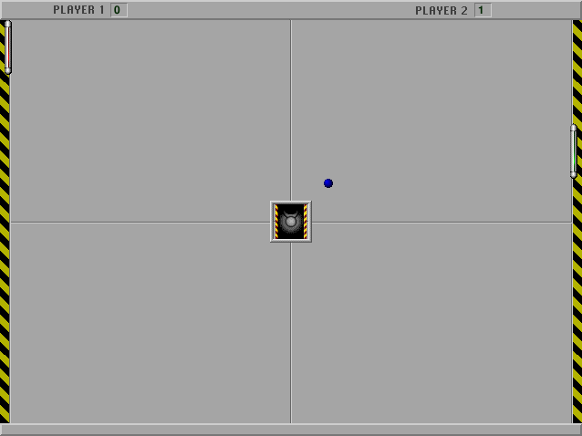

## Return the ball

Press **B** on the menu to begin. Use **Shift** to move the left paddle up and
**Option** to move it down; **Space** makes it move faster. The ball speeds up
when it hits the end of a paddle. The first player to 15 points wins.
