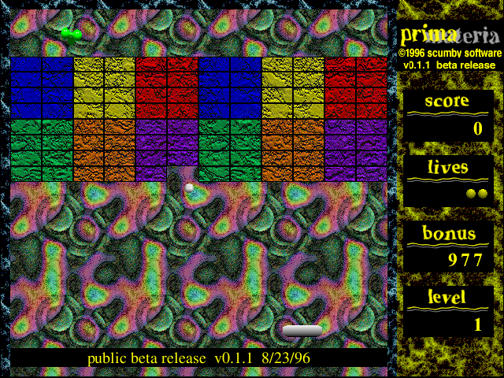

## Keep the ball in play

Select **play** from the high-scores menu. Move the mouse left and right to
position the paddle, bounce the ball through the bricks, and collect power-ups.
This is the original free beta release, with its Read Me and game data intact.
