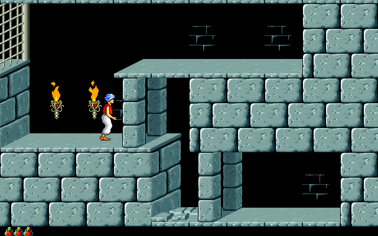

## Sixty minutes, one dungeon

The demo opens with the palace title sequence, then drops the Prince into the
first underground chamber. Movement has weight: a running start carries him
across a gap, a careful step avoids a loose tile, and reaching a ledge is only
half the task because he still has to catch it. Torches, gates, pressure plates
and concealed passages turn the stonework into a chain of physical puzzles.

This Macintosh conversion preserves the rotoscoped animation that made the
original distinctive. The Prince accelerates into a run, braces on landing and
pulls himself over ledges one deliberate motion at a time. The demonstration
includes colour, LC and black-and-white data so the same package could adapt to
several contemporary Macintosh displays.

## The original promotional package

Systemless opens Brøderbund's StuffIt archive directly, discovers the demo
application and its matching data files, and reaches live Level 1 gameplay.
The current deterministic run exercised sustained movement through the first
obstacle and matched the BasiliskII oracle at 99.8% overall perceptual parity.

The package identifies itself as a demo and includes Brøderbund's original
ordering information. It is preserved byte-for-byte rather than replaced with
the retail game, a cracked copy or a browser remake. The launcher remains
disabled until the archive and screenshot complete asset promotion and browser
review.
