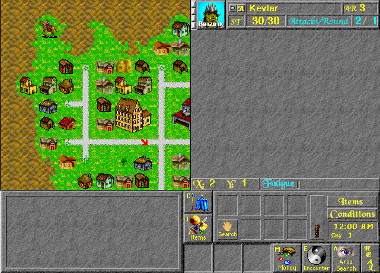

## Begin in Bywater

Realmz is Fantasoft's Macintosh fantasy role-playing game. Begin with the
included City of Bywater scenario, build a party, and explore its town and
surrounding encounters. This entry uses the original, complete 5.1 shareware
distribution; registration and any restrictions on additional scenarios are
unchanged. The bundled licence permits non-profit distribution of complete,
unmodified copies. The game and artwork remain Fantasoft's property.
