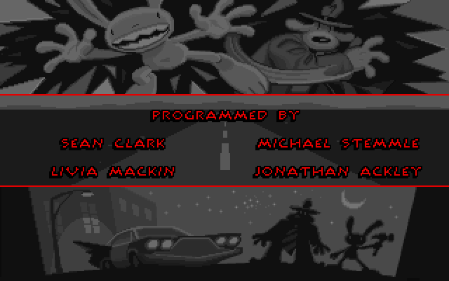

## Freelance police, reporting for duty

Sam is a six-foot canine detective. Max is a hyperkinetic rabbity thing. When
the commissioner sends them after a missing carnival attraction, the case turns
into a road trip through LucasArts' most gleefully unruly corner of America.
The SCUMM interface lets players investigate, improvise and inflict their own
peculiar brand of justice with verbs, dialogue and inventory objects.

This Macintosh demonstration opens with the game's animated road sequence and
then challenges the player with the first puzzle from the adventure. It is a
compact showcase for the hand-drawn animation, comic timing and irreverent
writing that made Sam and Max enduring adventure-game characters.

## LucasArts' Macintosh demonstration

This is the original promotional demo, not the commercial game. The included
LucasArts read-me explicitly calls it the Sam & Max demo, invites players to
solve its opening challenge and gives ordering details for the complete game.
ScummVM's official demo library identifies the download specifically as the
Macintosh demo and continues to provide the original ZIP.

The catalogue stages that archive byte-for-byte. Systemless decodes and launches
the original 68K MacBinary application directly, preserving its accompanying
data file and read-me. A deterministic run verifies the animated opening using
the exact staged archive, with BasiliskII providing an independent cross-check.
