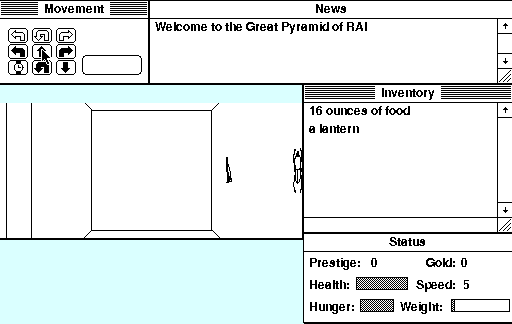

## Into the pyramid

Search the Great Pyramid of Ra for lost artefacts, using the on-screen controls
to explore its changing rooms and keep track of your supplies. Rick Holzgrafe's
original version 1.4 remains available as shareware from Semicolon Software.

This entry uses a preserved HFS disk-image repack of that game so Systemless
can launch it directly. Headless movement works; browser launch awaits manual
verification.
