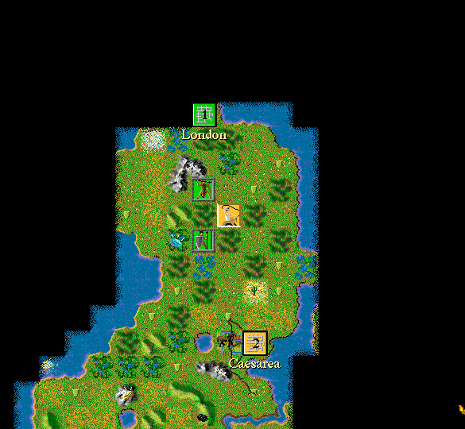

## An empire already in motion

The demo opens in 2100 BC with a Roman civilization spread across a revealed
island. London and Caesarea anchor the map, while chariots, settlers and other
units wait for orders among roads, forests, hills and coast. The compact
scenario exposes the decisions that define Civilization: explore the terrain,
inspect cities, balance their production and decide where each unit should go.

MicroProse describes the demonstration as a limited selection taken from the
retail game. City screens expose population, food, trade, taxes, construction
and troop support; reports show the civilization's progress; and the
Civilopedia retains descriptions of technologies, wonders, units and city
improvements even though many of its retail illustrations were omitted to keep
the demo small.

## Preserved as MicroProse distributed it

The source package is the original StuffIt archive rather than a retail disk,
crack, repack or generated web bundle. Systemless opens the archive directly,
discovers the application and ReadMe, reaches the live Roman map and can open
the Civilopedia through the game's menu. The same deterministic sequence was
cross-checked under BasiliskII.

Take-Two continues the Civilization series through 2K. This catalogue preserves
only MicroProse's intentionally limited promotional demonstration byte-for-byte;
it does not provide the original retail game. The launcher remains disabled
until the archive and screenshot complete asset promotion and browser review.
