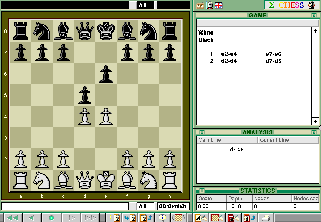

Play the original **Sigma Chess 4.0 Lite** freeware distribution. Drag a white
piece to a legal square; the computer responds as black. The board starts at
five minutes per player. **Analyze → Stop** interrupts a search and plays the
best move found. Use **File → New Game** when it is your turn to start again.

Bounded native verification covers **e2–e4**, **d2–d4**, and the computer replies
**e7–e6**, **d7–d5** with the move record updated. Optimized browser verification also passes both player moves and computer replies.
Public release verification is pending.
Complete matches, sustained search, other modes, saving and audio remain
unverified. The original Lite edition retains its feature limits, including
unsavable libraries and limited transposition tables.

This original main game is **68K only**. The included PPC endgame generators
are auxiliary tools and are not counted as a second game or a PPC game port.
The complete original archive retains all 164 files and distribution notices.
