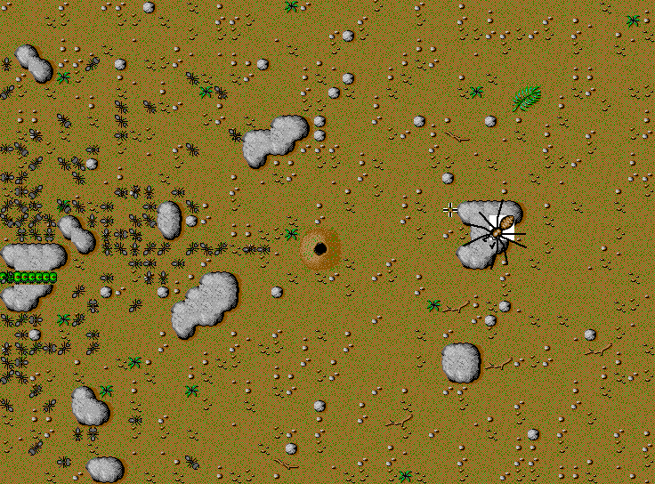

## A promotional look at the colony

This is the original *SimAnt Color Demo* distributed on Apple's 1992
Macintosh Demo Games CD. It opens an animated ant-colony scene after a display
mode prompt. The available evidence does not establish that its controls offer
the complete game's interactive modes, so this listing presents it as a
promotional demonstration rather than a playable copy of *SimAnt*.

The archive preserves the demo application and its resource fork in MacBinary
form. It contains no retail game disk or installed commercial files. Browser
launch remains disabled pending a release-mode browser check.
