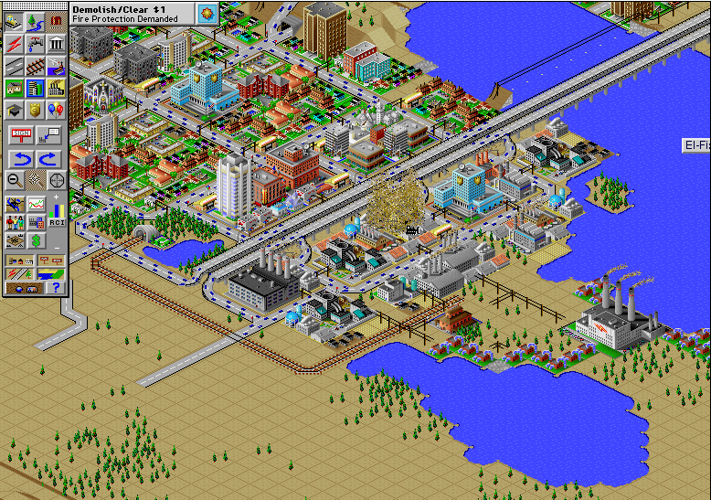

## A living city in miniature

The interactive demo opens Demo City as a working metropolis rather than a
scripted tour. Roads cross rail lines, power plants feed dense neighbourhoods,
traffic moves through the centre and the simulation continues to collect taxes
and update demand while the player changes the map.

This is a substantial demonstration of the original Macintosh game. Its tools
support zoning, roads, rails, power lines, parks and civic buildings. The map
can be rotated and zoomed, management windows expose population, industry and
neighbour data, and the disasters menu can interrupt an otherwise careful plan.

## Preserved without repacking

The source package is Maxis's original StuffIt archive. Systemless opens that
archive directly and discovers the application and Demo City file without a
converted disk image, extracted application or generated web package. A
deterministic run reaches the live city, dismisses the welcome and budget
dialogs, selects a construction tool and changes a visible map tile.

Electronic Arts is the present rights holder and still offers SimCity 2000
Special Edition commercially. This catalogue uses only Maxis's time-limited
promotional demo, preserved byte-for-byte; it does not substitute or expose the
retail game. The launcher remains disabled until its promoted archive and page
have passed the production and browser-review gates.
