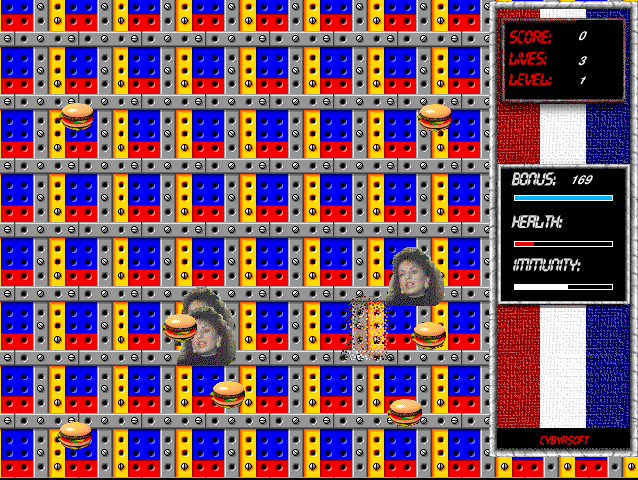

## Chase the burgers

Dismiss the startup notices and shareware reminder, choose **Play**, then
click the board to begin. Move the mouse to guide Willie toward burgers and
other bonus items while avoiding the roaming opponents. The Level 1 timer
counts down as you play.
