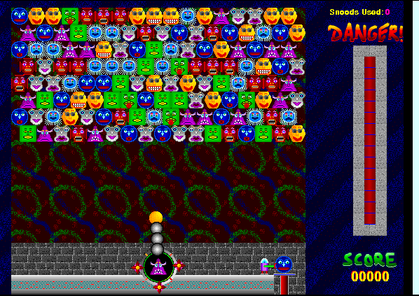

## Rescue the Snoods

Aim and launch Snoods at matching faces. Groups of three disappear, and any
Snoods they disconnect drop to safety. The Macintosh shareware edition includes
several difficulty levels and a registration reminder.

This is an unchanged original shareware package, including its read-me and
registration files, not a registered retail copy. Systemless reaches a live
game board; browser launch awaits manual approval.
