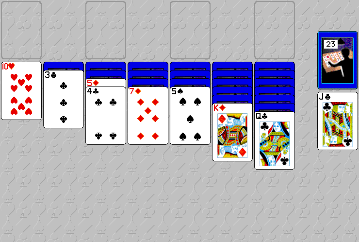

Play the original **Solitaire Till Dawn 4.0.1** shareware distribution. Acknowledge
its original **100-game** trial notice, choose **Not Yet**, then select a variant
from **Games**. Dismiss the ordinary welcome tip. Drag cards onto legal destinations
and click the stock to draw. The **Edit** menu offers undo and redo.

Bounded native verification covers **Klondike (Easy)**, a legal card move, the
revealed covered card and a stock draw. Browser qualification and publication are
pending. Full games, the other variants, sustained play, saves and audio remain
unverified. This original executable is **68K only**.

The complete unchanged publisher archive retains both illustrated guides, all
forty sample games, registration information and its original distribution notices.
