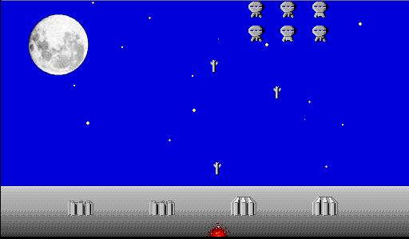

## Defend the Earth

Space Invaders 1.1 ƒ is Simone Bettini's colourful 68k take on the classic
arcade shooter. Move the defender with the mouse, keep the laser firing and
survive the descending formations.

## Preserved with its collection permission

The bundled ReadMe describes Space Invaders as MixWare and explicitly permits
the game to be included with its ReadMe in any shareware-freeware collection.
It asks to be advised and, if possible, to receive a copy of the collection;
the unchanged archive keeps both the game and ReadMe together, along with its
Icon.

## In Wave 1

Systemless reaches a live Wave 1 from the exact archive, with the defender,
invaders and projectiles visible. A deterministic mouse-input run moved the
defender, producing distinct before and after frames and verifying gameplay
beyond launch and menu navigation.
