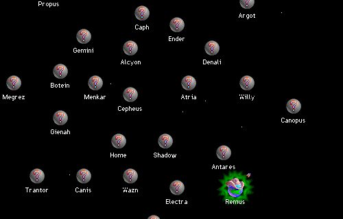

## Settle the stars

Spaceward Ho! begins by letting you shape the galaxy: choose its density and
layout, set the computer opponents' strength and decide how many will share the
map. Once inside, each named planet is a possible colony, resource source or
frontier. Your home world supplies the first ships and budget, while the map
quickly fills with decisions about exploration, technology and defence.

## The original 3.0 demo

This is Delta Tao's unchanged Macintosh demonstration, not the complete game.
Its own opening screen permits the demo to be given away without charge. The
catalogue preserves that exact package; the later commercial editions,
including the currently sold iOS adaptation, are not included.
