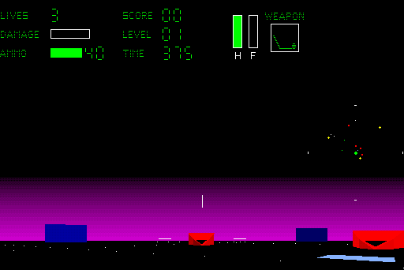

## Into the arena

Spectre VR puts the player inside a tank for a first-person arena fight. The
demo's launcher leads through vehicle selection into Level 1, with a live
score, timer, damage meter and weapon display around the 3D view.

This is Velocity Development's original CD demo, not the commercial release.
Its included read-me describes the demo and what differs in the retail game.
The original StuffIt archive is preserved byte-for-byte. Systemless reaches the
live arena, but its custom launcher buttons currently lack their icon artwork;
the compatibility status therefore remains at “boots” pending a fuller
interactive check and a rendering fix.
