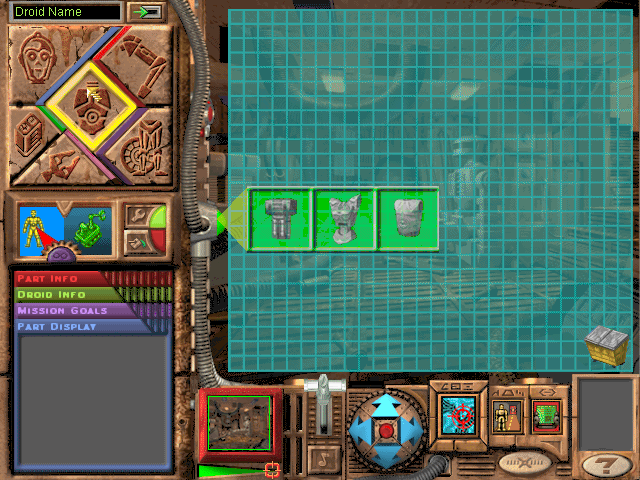

## Build a droid

Lucas Learning's original demo lets players assemble a droid from parts in the
Jawa workshop and try it in a mission. The bundled Read Me describes wheeled,
legged and tread designs, along with painting and testing a creation. This is
the complete, unchanged Power Macintosh demo package.

