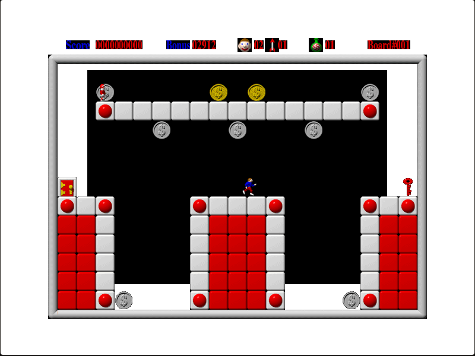

## Build a path to the key

Click Start to enter the first board. By default, J and L run left and right,
I jumps, A and Z switch blocks, and S and X use weapons. You can inspect or
change these keys in Options → Set Keys. Collect the key, then reach the door.
