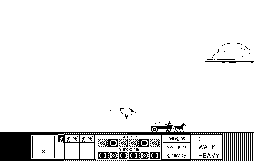

## Time the drop

Choose **Begin** to start. Move the mouse to position the helicopter, then click
as the cart passes beneath it to drop the stuntman.

This entry uses Duane Blehm's original 68k game, released to the public domain
by his family. The application resource fork is unchanged; its MacBinary
container supplies the file metadata needed by the browser runtime.
