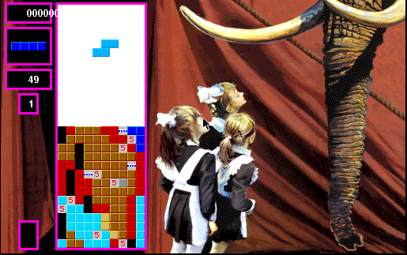

## Falling blocks with a twist

Super Tetris keeps the familiar rhythm of moving and rotating falling pieces,
then adds treasure blocks and bombs to the board. The Macintosh colour demo
opens with illustrated instructions before letting the player start a game.

This entry preserves Spectrum HoloByte's original promotional demo archive,
not the commercial release. It contains separate black-and-white and colour
applications; Systemless has been checked with the colour version. Browser
launch awaits manual approval.
