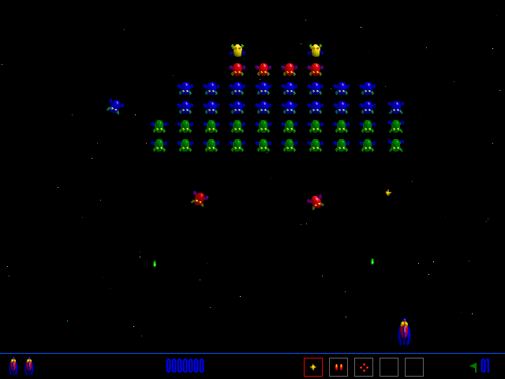

Fight waves of aliens in the original **Swoop 1.0.2** shareware release.
Choose **Not Yet** at the original trial notice, then press **N** to start.
Default controls are **Z** to move left, **X** to move right, **period** to fire
and **slash** to select a weapon. Press **C** at the menu to inspect or change
controls. **Escape** aborts a game; **Caps Lock** pauses it.

The complete original installer archive retains its licence, registration
application, documentation and media. Bounded native testing covers starting an
active wave, moving the ship and firing. This version uses 68K code; its original
FAQ describes Power Mac support through emulation. Browser approval and public
launch remain pending. Full waves, scoring, sustained play, saves and audio
remain unverified.
