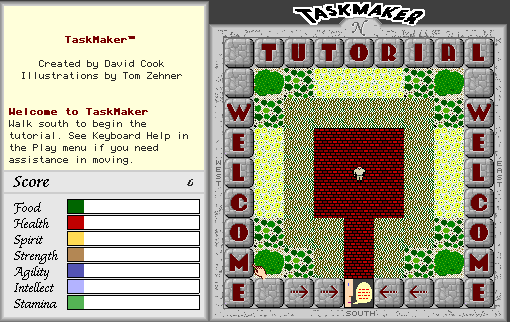

## A task awaits

Storm Impact's Macintosh role-playing adventure sends a new hero through
villages, dungeons, monsters and quests. This entry uses the complete,
unregistered 2.2.4 shareware package still offered by its creator, including
the original sounds and color artwork. It is not an unlocked or modified copy.

The game's Distribution notice encourages sharing complete, unchanged copies
without charging for them. Registration rights and the game's copyright remain
with its owner. In Systemless, New opens character creation and Return reaches
the tutorial board. The New/Open dialog's background artwork is currently
missing, and browser launch remains disabled until the promoted archive has
been checked in a browser.
