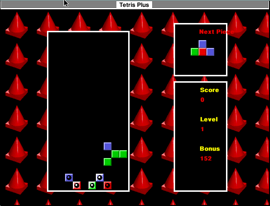

## Match colours as pieces fall

Choose **Game → New Game** to start. Use keypad **4** and **6** to move left
and right, keypad **2** to descend, and keypad **9** and **8** to rotate.
The Game menu also has **Configure Keys** if your keyboard lacks a keypad.
Match three or more blocks of the same colour and clear the flash blocks.
