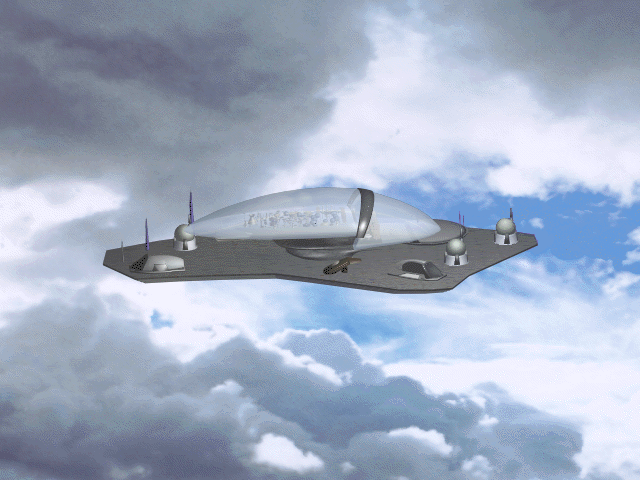

## The original sneak preview

Presto Studios called this 1992 release a digital trailer for *The Journeyman
Project*. It presents scenes from the time-travel adventure; it is not the
complete commercial game or a playable level demo.

The publisher's Read Me permits copying the complete preview folder. This
archive preserves the application, Read Me, and all 27 support files from
Apple's Macintosh Demo Games CD. A colour 68K Macintosh with at least 5 MB of
RAM was the stated requirement; the CD-ROM drive mentioned in the Read Me was
for the full game, not this preview.

Browser launch remains disabled until the packaged preview is checked in a
release-mode browser. The later *Pegasus Prime* demo is a separate PowerPC-only
release and is not substituted here.
