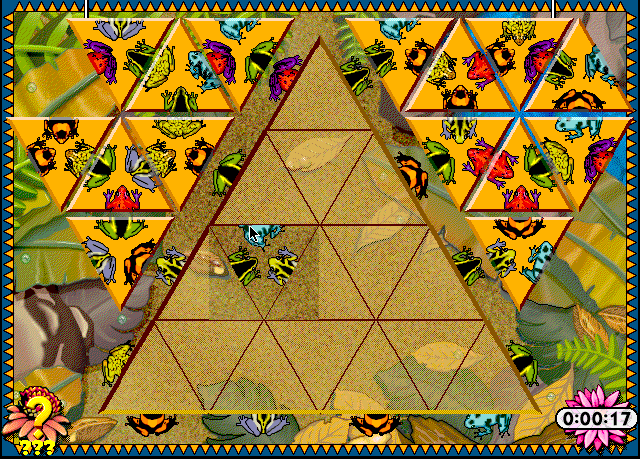

## Match the creatures

Press Return at the title and again to dismiss How to Play. Select a triangle,
then drag it onto the board. Click a piece to rotate it, or Option-click to
rotate in the other direction. Match every creature along the touching edges.
The How to Play dialog may leave a thin outline over the board.
