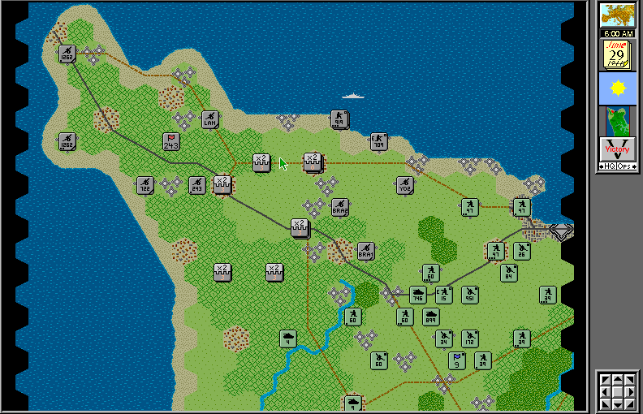

## One campaign on Utah Beach

V for Victory puts you in command of Allied or Axis units on the Cotentin
Peninsula. Select a side and plan movement, attacks and support across a
hexagonal map while the staff assistant reports the changing situation.

This is Atomic Games' original Macintosh demonstration, not the complete
commercial series. It includes only the introductory Utah Beach scenario;
Save and Restore are disabled. At startup, the non-FPU application may advise
using the FPU version on a suitable Macintosh. Press Return to continue.
