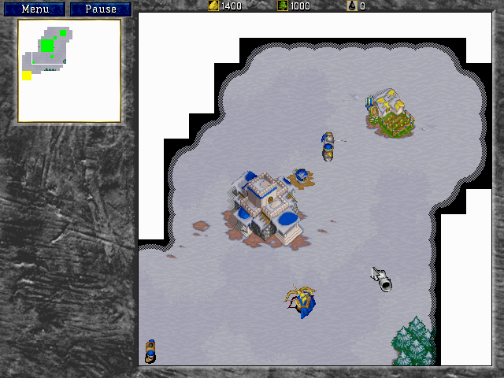

## Build, scout, attack

Warcraft II turns a few workers and an unexplored map into a race for resources,
technology and position. The Macintosh demo supports 68040 and PowerPC systems;
this entry keeps Blizzard's complete original archive unchanged.

The shareware campaign opens at Hillsbrad with a town hall, farm, workers and
an unexplored winter map. Its objectives retain the complete game's essential
rhythm: gather gold and lumber, establish a barracks and additional farms, then
turn a vulnerable settlement into a functioning military outpost.

Systemless accepts the original startup options, renders the animated
introduction, navigates the campaign briefing and reaches live mission play
with units, resources, construction, fog-of-war and the minimap active. The
same unchanged archive launches through the title and menu sequence under
BasiliskII. The 68k application is verified; the PowerPC path remains to be
verified.

## Blizzard's original shareware release

This is Blizzard's deliberately distributed Macintosh shareware demo, not the
retail game. The bundled Vendor text grants electronic redistribution of the
complete, unchanged shareware program without charge, while reserving retail,
CD and bundled distribution. The catalogue preserves that exact archive and
does not extend the permission to modified copies or commercial media.
