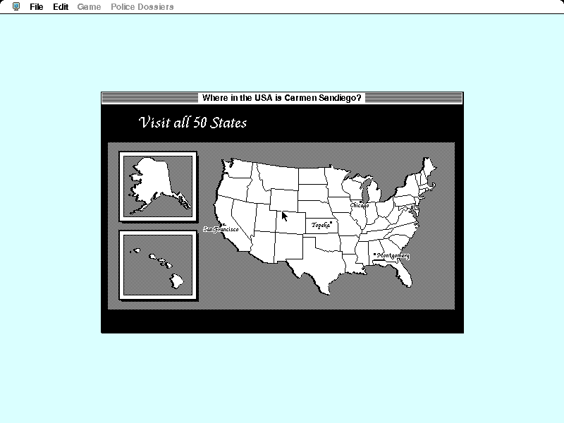

## Chase the gang across America

A stolen monument starts a chase across all fifty states. Witnesses reveal
geographic clues, travel choices consume precious time, and the detective has
to identify the suspect before making an arrest. The familiar Carmen Sandiego
loop turns maps, landmarks and state history into the tools of an investigation.

The demonstration introduces that loop with a guided national tour and a
playable sample case. It creates a named detective, assigns a missing monument,
and opens the original Game and Police Dossiers menus for the pursuit.

## Brøderbund's cover-disc demonstration

This is the original `Carmen USA Demo`, not the retail game and not *Where in
the World Is Carmen Sandiego?*. It is included as the closest legally
distributable period demonstration for that target-list slot. The preserved
package was deliberately circulated on at least two contemporary software
discs and identifies itself throughout as a demo.

Systemless opens the unchanged StuffIt archive, plays the animated tour,
accepts a detective name and begins the supplied sample assignment. A
deterministic run reaches that playable case, while BasiliskII independently
confirms the same archive's startup and tour sequence.
