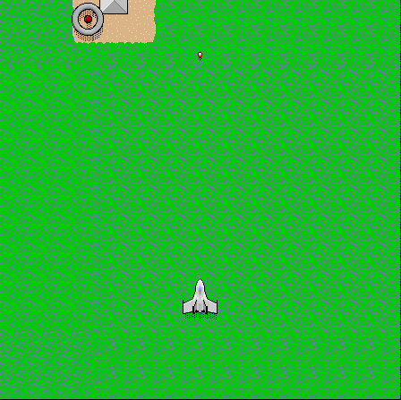

## Defend the skies

Press **Shift** on the title screen to begin. Use **Escape** to open setup,
where you can assign movement keys and change the fire and bomb controls.
Assign the arrow keys there for movement; **Shift** fires and **Command** drops bombs.
The original package includes the game, its data folder, and full instructions.
